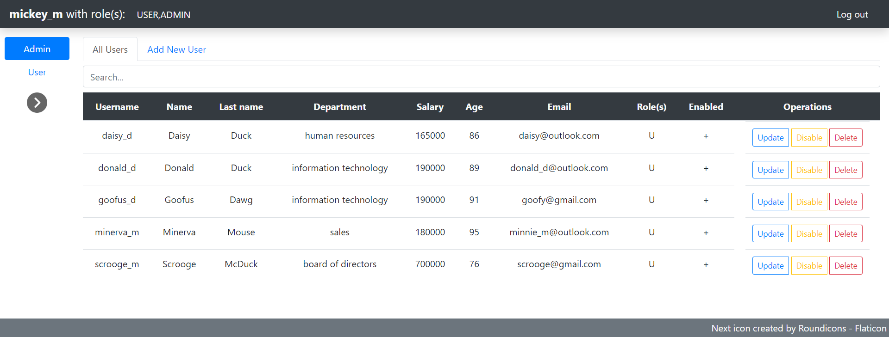
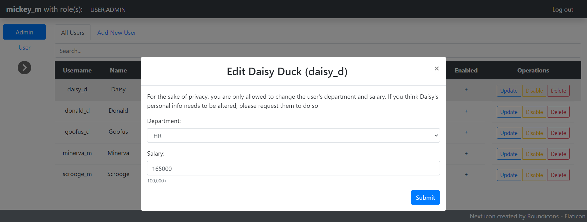
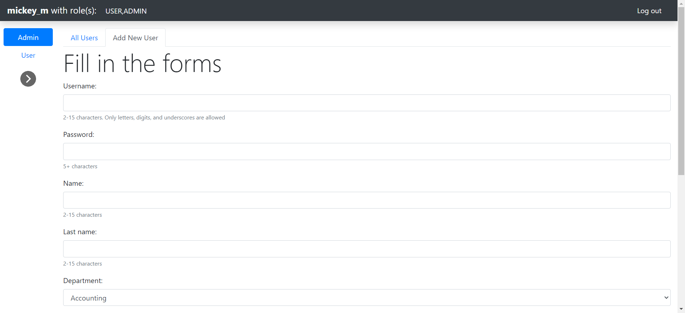
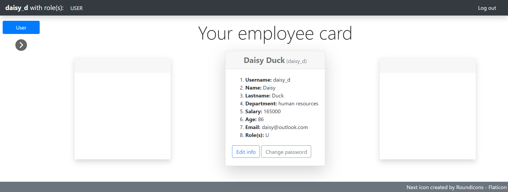
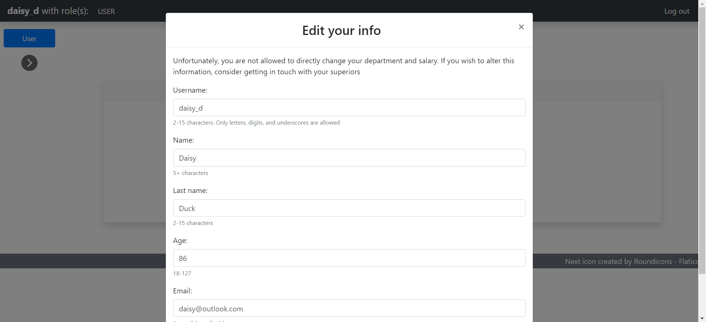
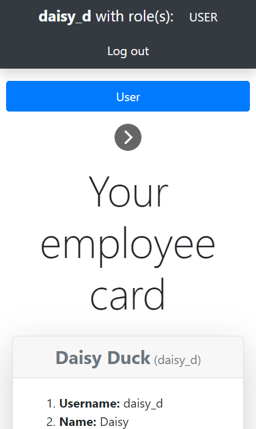

**User Management System** is a web application that allows you to add, delete, and edit user records stored in an underlying relational database

The easiest way to start the application is to run it within a Docker container

1. Ensure Docker is installed on your machine (for example, Windows users can use [Docker Desktop](https://docs.docker.com/desktop/install/windows-install/))
2. Ensure Git is installed too and clone this project (`git clone https://github.com/NadChel/user-management-system path/to/project`)
3. Navigate to the project root (`cd path/to/project/user-management-system` in CommandPrompt) and execute the `docker-compose up` command. It may take several minutes
4. Once the containers are up and running, you can open `http://localhost:8080/` in your web browser of choice, authenticate, and interact with application's web interface
```txt
INFO 1 --- [           main] pp.users.UserManagementSystemApplication      : Started UserManagementSystemApplication in 19.813 seconds (process running for 20.803)
```

*<small>log message similar to this is a good indication that the app is ready to use</small>*


*<small>login page</small>*

On application's startup, a `users` table will be automatically created with several sample users. Those are:

|      User | Password |    Role(s) |
|----------:|---------:|-----------:|
|  mickey_m |   mickey | USER,ADMIN |
| minerva_m |  minerva |       USER |
|  donald_d |   donald |       USER |
|   daisy_d |    daisy |       USER |
|  goofus_d |   goofus |       USER |
| scrooge_m |  scrooge |       USER |

Depending on what roles a user has, the graphical user interface will look different. Specifically, the ADMIN user will have an `Admin` tab that provides more ways to modify the data

|                                     | USER | ADMIN |
|-------------------------------------|------|-------|
| Edit own personal info              | +    | -     |
| Change own password                 | +    | -     |
| Edit other users' department/salary | -    | +     |
| Add new user                        | -    | +     |
| Disable user                        | -    | +     |
| Delete user                         | -    | +     |

Since no default user has the ADMIN role without having the USER role too, the default ADMIN user in effect can do everything a regular USER can as well

# ADMIN interface



*<small>user table</small>*



*<small>edit user modal</small>*



*<small>add new user tab</small>*

# USER interface



*<small>user card (a.k.a. employee card)</small>*



*<small>edit info modal</small>*



*<small>user card with small screen width</small>*
